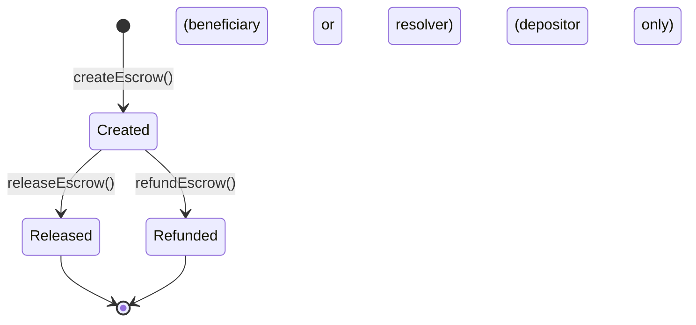
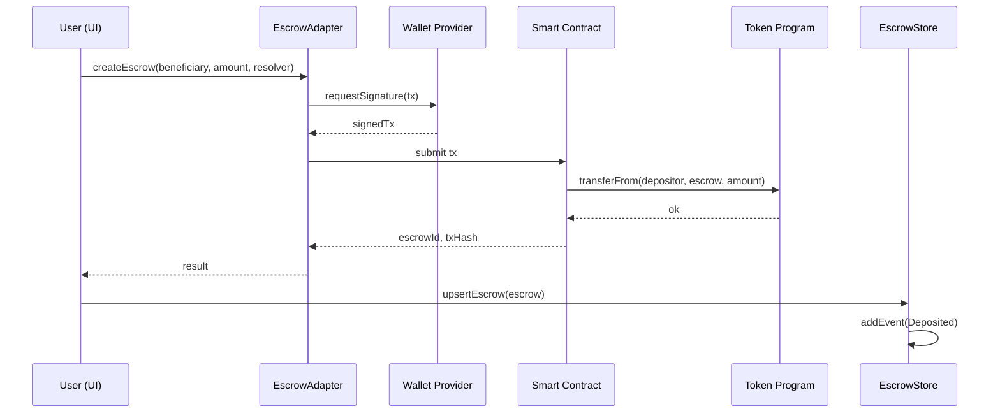
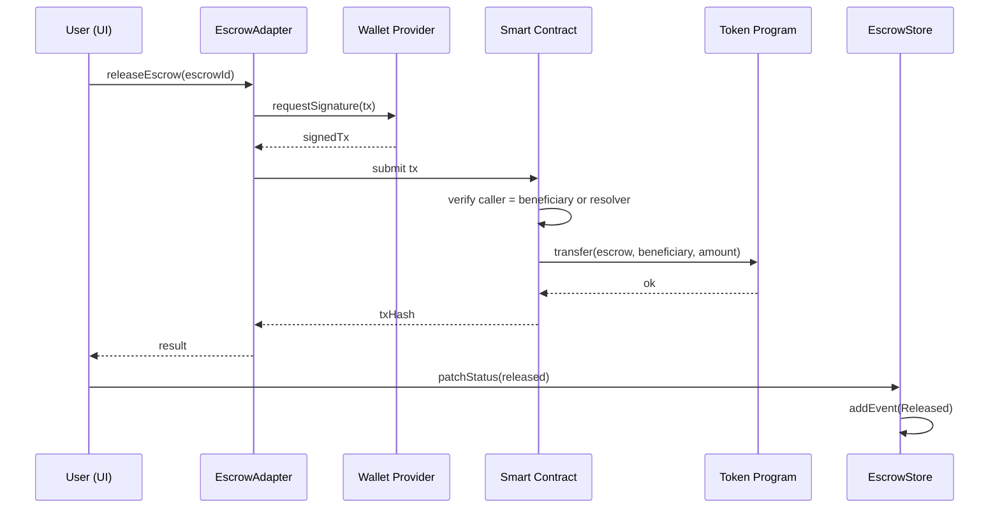
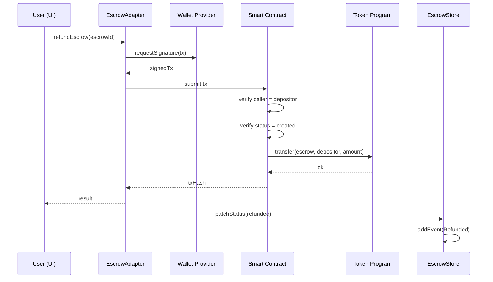
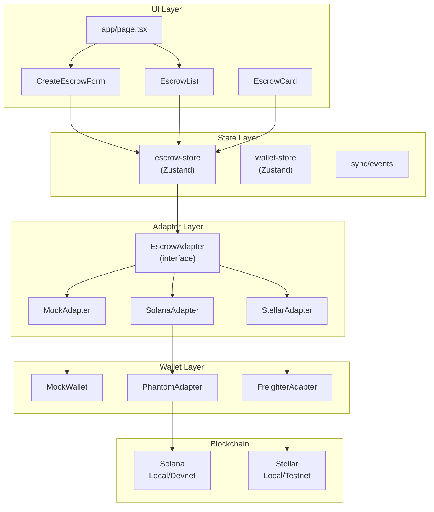

# Multi-Chain Escrow

A cross-chain escrow dApp supporting both **Solana** (Anchor) and **Stellar** (Soroban) through a unified adapter interface. Built with Next.js, TypeScript, Rust, and Zustand.

**Live demo:** [fe-olive-nine.vercel.app](https://fe-olive-nine.vercel.app)

---

## Table of Contents

- [Overview](#overview)
- [Architecture](#architecture)
- [UML Diagrams](#uml-diagrams)
- [Smart Contracts](#smart-contracts)
- [Frontend](#frontend)
- [Pages](#pages)
- [Quick Start](#quick-start)
- [Running Modes](#running-modes)
- [Project Structure](#project-structure)
- [Tech Stack](#tech-stack)
- [Deployed Contracts](#deployed-contracts)
- [Testing](#testing)
- [Documentation](#documentation)

---

## Overview

This project demonstrates end-to-end full-stack Web3 capabilities across two non-EVM blockchains. Users can create, release, and refund token escrows on either Solana or Stellar through a single chain-agnostic UI. The app includes interactive ReactFlow architecture diagrams and onboarding pages for EVM developers learning Solana and Stellar.

### Key Features

- **Multi-chain escrow** — Solana (Anchor) + Stellar (Soroban) smart contracts
- **Unified adapter pattern** — single `EscrowAdapter` interface, chain-agnostic UI
- **Role-based access** — depositor refunds, beneficiary/resolver releases
- **Wallet integration** — Phantom (Solana), Freighter (Stellar), mock wallet
- **Interactive diagrams** — ReactFlow sequence and architecture diagrams (zoom/pan/minimap)
- **EVM onboarding** — Learn pages comparing EVM concepts to Solana and Stellar
- **Event sync** — contract events polled and displayed in activity feed
- **Three modes** — mock (no blockchain), local chains, public testnets

---

## Architecture

```
┌─────────────────────────────────────────────────────────────────┐
│                          UI Layer                                │
│  app/page.tsx · CreateEscrowForm · EscrowCard · EscrowList      │
│  ActivityFeed · HowItWorks · Learn pages (Solana, Stellar)      │
├─────────────────────────────────────────────────────────────────┤
│                     State Layer (Zustand)                        │
│  escrow-store · wallet-store · sync/events                       │
├─────────────────────────────────────────────────────────────────┤
│                    Adapter Layer                                  │
│  EscrowAdapter (interface)                                        │
│  ├── MockEscrowAdapter                                            │
│  ├── SolanaEscrowAdapter (Anchor + @solana/web3.js)              │
│  └── StellarEscrowAdapter (Soroban + @stellar/stellar-sdk)       │
├─────────────────────────────────────────────────────────────────┤
│                    Wallet Layer                                   │
│  WalletProvider (interface)                                       │
│  ├── MockWalletProvider                                           │
│  ├── PhantomWalletProvider (Solana)                               │
│  └── FreighterWalletProvider (Stellar)                            │
├─────────────────────────────────────────────────────────────────┤
│                   Blockchain Layer                                │
│  Solana Localnet / Devnet · Stellar Localnet / Testnet           │
└─────────────────────────────────────────────────────────────────┘
```

The frontend never interacts with blockchains directly. All on-chain operations flow through the `EscrowAdapter` interface. A registry pattern maps each `ChainId` to its adapter instance, enabling runtime switching between chains without code changes.

---

## UML Diagrams

### Escrow State Machine



### Create Escrow — Sequence



### Release Escrow — Sequence



### Refund Escrow — Sequence



### Adapter Interface — Class Diagram

```mermaid
classDiagram
    class EscrowAdapter {
        <<interface>>
        +chainId: ChainId
        +createEscrow(params): Promise~{escrowId, txHash}~
        +releaseEscrow(escrowId): Promise~{txHash}~
        +refundEscrow(escrowId): Promise~{txHash}~
        +getEscrow(escrowId): Promise~Escrow | null~
        +listEscrowsByUser(address): Promise~Escrow[]~
        +subscribeEvents(onEvent): () => void
        +setWalletAddress(address): void
    }

    class SolanaEscrowAdapter {
        -connection: Connection
        -program: SolanaProgram
        -signerKeypair: Keypair
    }

    class StellarEscrowAdapter {
        -server: StellarRpc.Server
        -contractId: string
        -signerKeypair: string
    }

    class MockEscrowAdapter {
        -escrows: Map~string, Escrow~
        -events: EscrowEvent[]
    }

    EscrowAdapter <|.. SolanaEscrowAdapter
    EscrowAdapter <|.. StellarEscrowAdapter
    EscrowAdapter <|.. MockEscrowAdapter
```

### Component Architecture



---

## Smart Contracts

### Solana (Anchor)

- **Program:** `blockchains/solana/programs/escrow/`
- **State:** PDA-based escrow accounts
- **Token handling:** SPL Token CPI for deposits
- **Access control:** Role-based (depositor, beneficiary, resolver)
- **Events:** On-chain event logs

### Stellar (Soroban)

- **Contract:** `blockchains/stellar/contracts/escrow/`
- **State:** Persistent ledger entries (key-value)
- **Token handling:** SAC (Stellar Asset Contract) transfers
- **Access control:** `require_auth` for role verification
- **Events:** Soroban contract events

---

## Frontend

The frontend is a Next.js application in `fe/`. See [`fe/README.md`](fe/README.md) for detailed frontend documentation including adapter pattern, wallet integration, state management, and event synchronization.

- **Framework:** Next.js 16 + React + TypeScript 5
- **Styling:** Tailwind CSS v4
- **State:** Zustand stores (escrow, wallet, sync)
- **Diagrams:** ReactFlow (@xyflow/react) — interactive, zoomable
- **Wallets:** Phantom (Solana), Freighter (Stellar), Mock

---

## Pages

| Page | Route | Description |
|------|-------|-------------|
| Home | `/` | Escrow dashboard — create, list, activity feed |
| How it works | `/how-it-works` | Interactive ReactFlow diagrams (create/release/refund sequences, component architecture), Solana vs Stellar comparison |
| Learn: Solana | `/learn/solana` | Onboarding for EVM developers — account model, programs, SPL tokens, PDAs, rent, transactions, CPI |
| Learn: Stellar | `/learn/stellar` | Onboarding for EVM developers — Soroban, assets vs tokens, SAC, ledger entries, fees, trustlines |

---

## Quick Start

### Prerequisites

- **Node.js:** 20+ (see `fe/.nvmrc`)
- **bun:** [install](https://bun.sh) — `curl -fsSL https://bun.sh/install | bash`
- **Rust:** For contract compilation — `curl --proto '=https' --tlsv1.2 -sSf https://sh.rustup.rs | sh`
- **Solana CLI:** `sh -c "$(curl -sSfL https://release.solana.com/v1.18.0/install)"`
- **Stellar CLI:** `cargo install --locked soroban-cli`

### Mock Mode (default — no blockchain needed)

```bash
cd fe
bun install
cp .env.example .env        # NEXT_PUBLIC_MOCK_MODE=true by default
bun run dev
```

Open [http://localhost:3000](http://localhost:3000).

---

## Running Modes

### 1. Mock Mode (default)

No blockchain needed. All escrows and events are in-memory.

```bash
cd fe
bun install
NEXT_PUBLIC_MOCK_MODE=true bun run dev
```

### 2. Local Chains

```bash
# From repo root
npm run chain:solana          # Start Solana local validator
npm run chain:stellar         # Start Stellar local network (docker)

# Deploy contracts
npm run chain:solana:deploy   # Deploy Anchor escrow program
npm run chain:stellar:deploy  # Deploy Soroban escrow contract

# Fund test accounts
npm run chain:solana:faucet
npm run chain:stellar:faucet

# Start frontend
cd fe
NEXT_PUBLIC_MOCK_MODE=false bun run dev
```

### 3. Testnet

```bash
# Solana devnet
npm run chain:solana:deploy:devnet
npm run chain:solana:mint:devnet    # Create test SPL token

# Stellar testnet
npm run chain:stellar:deploy:testnet
npm run chain:stellar:sac:testnet   # Create Stellar Asset Contract

# Start frontend
cd fe
NEXT_PUBLIC_MOCK_MODE=false bun run dev
```

---

## Project Structure

```
multi-chain-escrow/
├── blockchains/
│   ├── solana/              # Anchor escrow program (Rust)
│   │   ├── programs/escrow/ #   Program source
│   │   ├── tests/           #   Program tests
│   │   └── scripts/         #   Deploy + faucet scripts
│   ├── stellar/             # Soroban escrow contract (Rust)
│   │   ├── contracts/escrow/#   Contract source
│   │   └── scripts/         #   Deploy + faucet scripts
│   └── scripts/             # Cross-chain health check
├── fe/                      # Next.js frontend
│   ├── src/
│   │   ├── app/             #   Pages (home, how-it-works, learn/solana, learn/stellar)
│   │   ├── components/      #   Shared UI (Header, diagrams, LearnNav, LearnSidebar)
│   │   ├── features/        #   Domain features (wallet, escrow, activity)
│   │   ├── adapters/        #   Chain adapters (Solana, Stellar, Mock)
│   │   ├── shared/          #   Types, utils
│   │   ├── config/          #   Chain configs, contract addresses, env
│   │   └── sync/            #   Event sync (contract events → store)
│   ├── package.json
│   ├── .env.example
│   └── README.md            #   Detailed frontend docs
├── docs/                    # Documentation
│   ├── demo/                #   Demo guides + limitations
│   ├── EPICS/               #   Epic + slice specs
│   └── CV/                  #   CV and recruiter info
├── README.md                # This file
└── package.json             # Root workspace (chain scripts)
```

---

## Tech Stack

| Layer | Technologies |
|-------|-------------|
| **Frontend** | Next.js 16, React, TypeScript 5, Tailwind CSS v4, Zustand, ReactFlow (@xyflow/react) |
| **Solana** | Rust, Anchor framework, SPL Token, @solana/web3.js, Phantom wallet |
| **Stellar** | Rust, Soroban SDK, SAC/SEP-41, @stellar/stellar-sdk, Freighter wallet |
| **Testing** | Vitest, Playwright, Anchor tests, Soroban snapshot tests |
| **Deployment** | Vercel (frontend), Solana devnet, Stellar testnet |

---

## Deployed Contracts

| Chain | Network | Program/Contract | Status |
|-------|---------|-----------------|--------|
| Solana | Devnet | Anchor Escrow Program | Deployed |
| Solana | Devnet | SPL Token Mint | Deployed |
| Stellar | Testnet | Soroban Escrow Contract | Deployed |
| Stellar | Testnet | SAC Token | Deployed |

> Contracts are deployed on public testnets only. No mainnet deployment.

---

## Testing

```bash
# Frontend tests
cd fe
npx vitest run                    # All tests
npx vitest run src/adapters/      # Adapter tests only
npx vitest run src/components/    # Component tests only

# Solana contract tests
cd blockchains/solana
anchor test

# Stellar contract tests
cd blockchains/stellar
soroban contract test
```

---

## Documentation

- [Frontend README](fe/README.md) — Detailed frontend architecture, adapter pattern, wallet integration
- [Reviewer Demo Guide](docs/demo/reviewer-guide.md) — 5-minute walkthrough
- [Demo Script](docs/demo/script.md) — Full create → release / create → refund cycle
- [Limitations](docs/demo/limitations.md) — What this demo does and doesn't do

### In-App Pages

- [How it works](https://fe-olive-nine.vercel.app/how-it-works) — Interactive ReactFlow diagrams
- [Learn: Solana](https://fe-olive-nine.vercel.app/learn/solana) — Solana for EVM developers
- [Learn: Stellar](https://fe-olive-nine.vercel.app/learn/stellar) — Stellar for EVM developers

---

## Environment Variables

See `fe/.env.example` for all options:

| Variable | Default | Description |
|----------|---------|-------------|
| `NEXT_PUBLIC_MOCK_MODE` | `true` | Use mock adapters (no blockchain) |
| `NEXT_PUBLIC_RPC_SOLANA_LOCAL` | `http://localhost:8899` | Solana local RPC |
| `NEXT_PUBLIC_RPC_SOLANA_DEVNET` | `https://api.devnet.solana.com` | Solana devnet RPC |
| `NEXT_PUBLIC_RPC_STELLAR_LOCAL` | `http://localhost:8000/rpc` | Stellar local RPC |
| `NEXT_PUBLIC_RPC_STELLAR_TESTNET` | `https://soroban-testnet.stellar.org` | Stellar testnet RPC |
| `SOLANA_LOCAL_KEYS_DIR` | `../blockchains/solana/.local-keys` | Solana keypair directory |
| `STELLAR_LOCAL_KEYS_DIR` | `../blockchains/stellar/.local-keys` | Stellar keypair directory |

---

## Main Commands

| Command | Description |
|---------|-------------|
| `cd fe && bun run dev` | Start Next.js dev server |
| `cd fe && bun run build` | Production build |
| `cd fe && bun run lint` | ESLint |
| `cd fe && npx vitest run` | Run all frontend tests |
| `npm run chain:solana` | Start Solana local validator |
| `npm run chain:solana:stop` | Stop Solana validator |
| `npm run chain:stellar` | Start Stellar local network |
| `npm run chain:stellar:stop` | Stop Stellar network |
| `npm run chain:solana:deploy` | Deploy Solana escrow program |
| `npm run chain:stellar:deploy` | Deploy Stellar escrow contract |
| `npm run chain:health` | Check all local chains are running |
