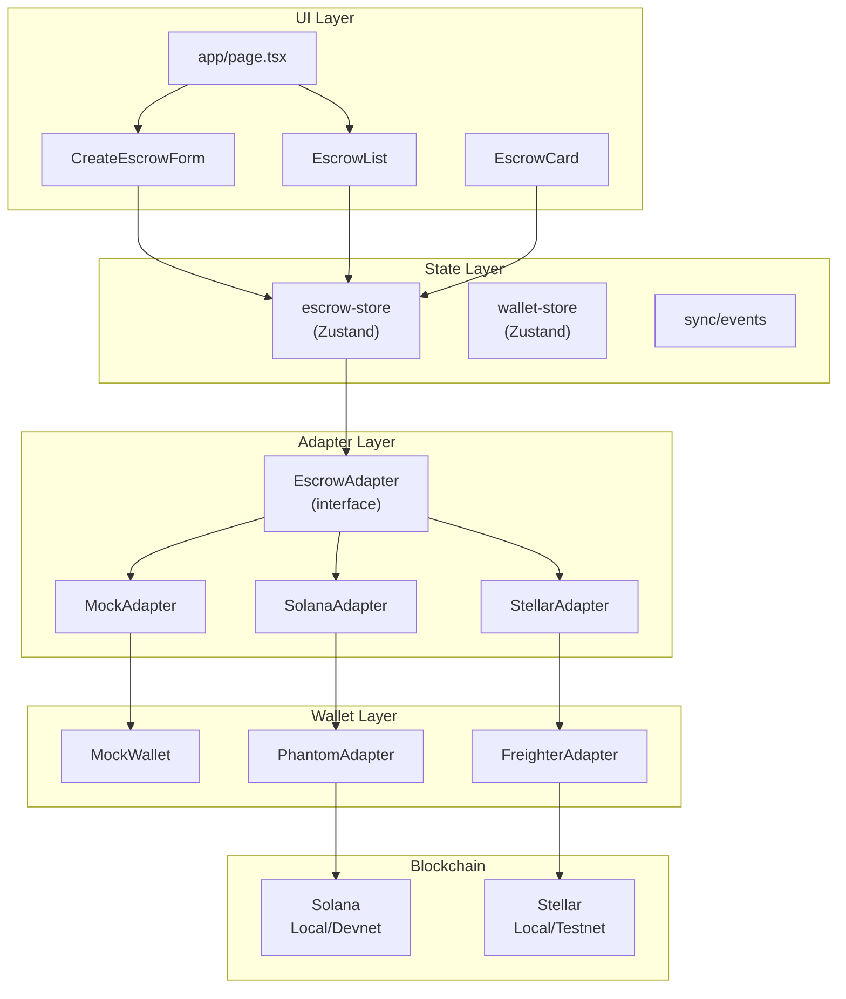
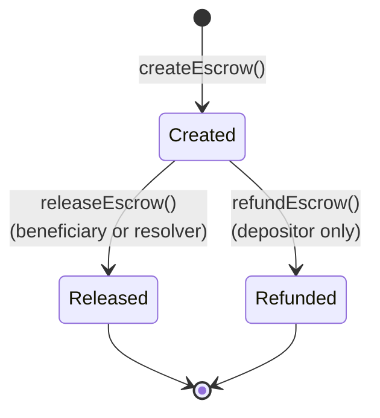
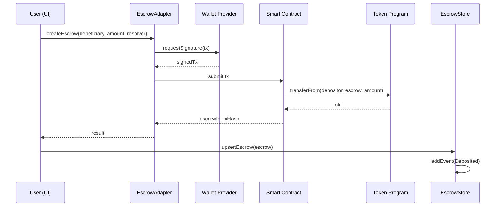
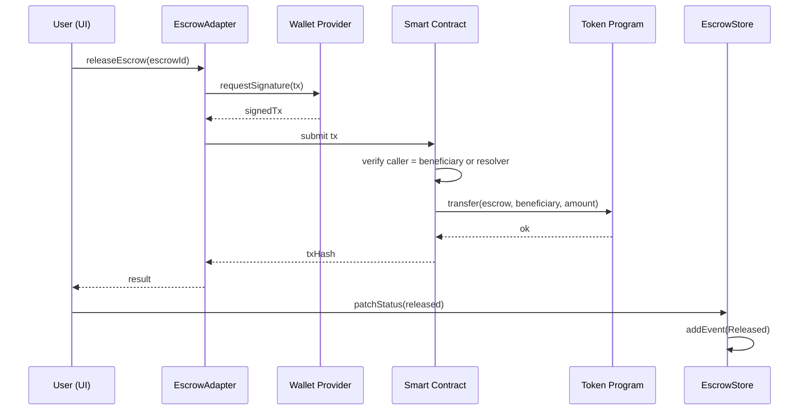
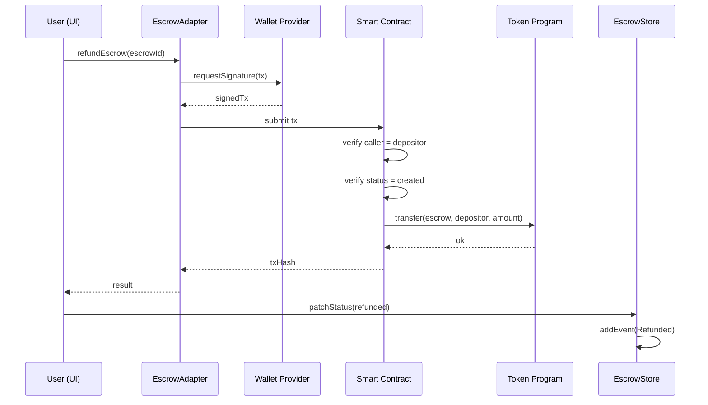
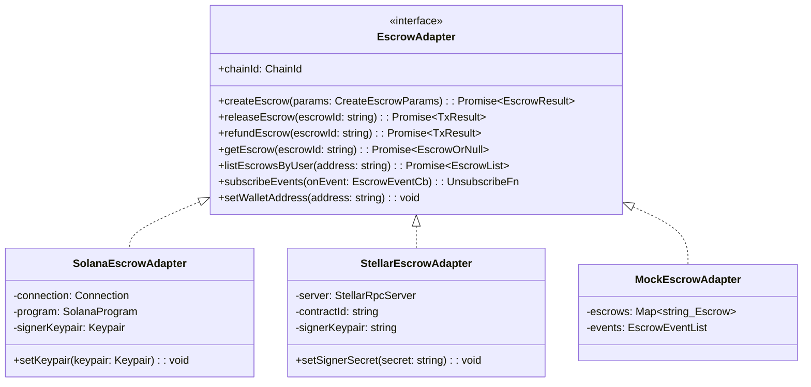
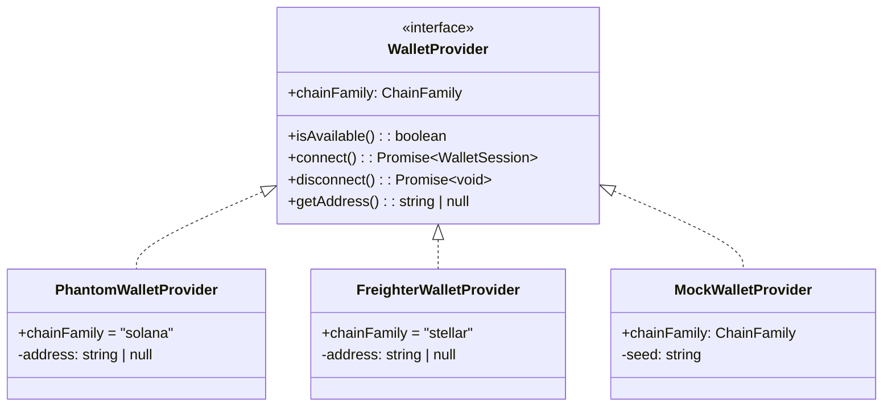

# Multi-Chain Escrow — Frontend

A cross-chain escrow dApp frontend built with **Next.js 16**, **TypeScript 5**, **Tailwind CSS v4**, and **Zustand**. It provides a unified adapter interface that abstracts over **Solana** (Anchor) and **Stellar** (Soroban) smart contracts, allowing users to create, release, and refund token escrows on either chain through a single UI.

**Live deployment:** [fe-olive-nine.vercel.app](https://fe-olive-nine.vercel.app)

## Table of Contents

- [Architecture Overview](#architecture-overview)
- [UML Diagrams](#uml-diagrams)
- [Smart Contracts](#smart-contracts)
- [Adapter Pattern](#adapter-pattern)
- [Wallet Integration](#wallet-integration)
- [State Management](#state-management)
- [Event Synchronization](#event-synchronization)
- [Pages & Features](#pages--features)
- [Tutorials](#tutorials)
- [Prerequisites](#prerequisites)
- [Getting Started](#getting-started)
- [Nginx Proxy](#nginx-proxy)
- [Scripts](#scripts)
- [Project Structure](#project-structure)
- [Tech Stack](#tech-stack)
- [Deployed Contracts](#deployed-contracts)
- [Testing](#testing)

## Architecture Overview

The application follows a **layered architecture** with a clear separation of concerns:

```text
┌─────────────────────────────────────────────────────────────┐
│                        UI Layer                              │
│  app/page.tsx · CreateEscrowForm · EscrowCard · EscrowList  │
│  ActivityFeed · HowItWorks · Learn pages                     │
├─────────────────────────────────────────────────────────────┤
│                     State Layer (Zustand)                     │
│  escrow-store · wallet-store · sync/events                   │
├─────────────────────────────────────────────────────────────┤
│                    Adapter Layer                              │
│  EscrowAdapter (interface)                                    │
│  ├── MockEscrowAdapter                                        │
│  ├── SolanaEscrowAdapter (Anchor + @solana/web3.js)          │
│  └── StellarEscrowAdapter (Soroban + @stellar/stellar-sdk)   │
├─────────────────────────────────────────────────────────────┤
│                    Wallet Layer                               │
│  WalletProvider (interface)                                   │
│  ├── MockWalletProvider                                       │
│  ├── PhantomWalletProvider (Solana)                           │
│  └── FreighterWalletProvider (Stellar)                        │
├─────────────────────────────────────────────────────────────┤
│                   Blockchain Layer                            │
│  Solana Localnet / Devnet · Stellar Localnet / Testnet       │
└─────────────────────────────────────────────────────────────┘
```

The frontend never interacts with blockchains directly. All on-chain operations flow through the `EscrowAdapter` interface, which has three implementations (Mock, Solana, Stellar). A registry pattern (`adapterRegistry`) maps each `ChainId` to its adapter instance, enabling runtime switching between chains without code changes.

## UML Diagrams

### Component Architecture



### Escrow State Machine



### Create Escrow — Sequence Diagram



### Release Escrow — Sequence Diagram



### Refund Escrow — Sequence Diagram



### EscrowAdapter Interface — Class Diagram



### Wallet Provider — Class Diagram



## Smart Contracts

The escrow logic is implemented on two blockchains with equivalent functionality but different architectures:

### Solana — Anchor Escrow Program

**Location:** `blockchains/solana/programs/escrow/`

| Instruction | Description |
|-------------|-------------|
| `create_escrow` | Initializes a PDA escrow account, transfers SPL tokens from depositor ATA to escrow ATA via CPI |
| `release_escrow` | Verifies caller is beneficiary or resolver, transfers tokens to beneficiary, sets status to `Released` |
| `refund_escrow` | Verifies caller is depositor and status is `Created`, returns tokens to depositor, sets status to `Refunded` |

**PDA Seeds:** `[b"escrow", depositor, beneficiary, nonce_le_bytes]`

**On-chain state** (`EscrowAccount`):

| Field | Type | Description |
|-------|------|-------------|
| `depositor` | `Pubkey` | Token depositor address |
| `beneficiary` | `Pubkey` | Intended recipient |
| `resolver` | `Pubkey` | Optional third-party arbitrator |
| `mint` | `Pubkey` | SPL token mint |
| `amount` | `u64` | Locked amount (base units) |
| `status` | `EscrowStatus` | `Created` / `Released` / `Refunded` |
| `nonce` | `u64` | Unique counter for PDA derivation |
| `bump` | `u8` | PDA bump seed |
| `created_at` | `i64` | Unix timestamp |
| `tx_hash_deposit` | `[u8; 32]` | Deposit tx signature |

**Events:** `DepositedEvent` (emitted on create)

### Stellar — Soroban Escrow Contract

**Location:** `blockchains/stellar/contracts/escrow/`

| Function | Description |
|----------|-------------|
| `create_escrow` | Stores escrow data in persistent storage, transfers tokens from depositor to contract via `TokenClient::transfer` |
| `release_escrow` | Verifies `require_auth()` + caller is beneficiary or resolver, transfers tokens to beneficiary |
| `refund_escrow` | Verifies `require_auth()` + caller is depositor, transfers tokens back to depositor |

**Storage:** Persistent ledger entries keyed by `DataKey::Escrow(nonce)` with auto-incrementing `DataKey::Counter`

**On-chain state** (`EscrowData`):

| Field | Type | Description |
|-------|------|-------------|
| `depositor` | `Address` | Token depositor |
| `beneficiary` | `Address` | Intended recipient |
| `resolver` | `Address` | Optional arbitrator |
| `token` | `Address` | SAC token contract address |
| `amount` | `i128` | Locked amount |
| `status` | `EscrowStatus` | `Created` / `Released` / `Refunded` |
| `nonce` | `u64` | Unique counter |
| `created_at` | `u64` | Ledger timestamp |

**Events:** `("Deposited", nonce)`, `("Released", nonce)`, `("Refunded", nonce)`

### Solana vs Stellar Comparison

| Aspect | Solana | Stellar |
|--------|--------|---------|
| Call type | Instruction program | `InvokeHostFunction` |
| Token handling | ATA, owner = PDA escrow | Balance in escrow contract (token contract) |
| Transfer | CPI → SPL Token | `TokenClient.transfer` |
| State | Account (Escrow PDA) | Persistent contract storage |
| Events | Anchor event / program log | Soroban event |
| Auth on release | Signer in accounts + pubkey check | `require_auth()` + Address comparison |
| Auth on refund | Signer = depositor | `require_auth()` = depositor Address |
| Local network | `solana-test-validator` (localhost:8899) | `soroban standalone` (localhost:8000) |
| Testnet faucet | `solana airdrop` | Friendbot |

## Adapter Pattern

The `EscrowAdapter` interface (`src/shared/types/escrow.ts`) is the central abstraction that decouples the frontend from blockchain specifics:

```typescript
interface EscrowAdapter {
  chainId: ChainId;
  createEscrow(params: CreateEscrowParams): Promise<{ escrowId: string; txHash: string }>;
  releaseEscrow(escrowId: string): Promise<{ txHash: string }>;
  refundEscrow(escrowId: string): Promise<{ txHash: string }>;
  getEscrow(escrowId: string): Promise<Escrow | null>;
  listEscrowsByUser(address: string): Promise<Escrow[]>;
  subscribeEvents(onEvent: (e: EscrowEvent) => void): () => void;
  setWalletAddress(address: string): void;
}
```

### Implementations

| Adapter | File | Description |
|---------|------|-------------|
| `MockEscrowAdapter` | `features/escrow/adapter/MockEscrowAdapter.ts` | In-memory escrows, no blockchain required |
| `SolanaEscrowAdapter` | `adapters/solana/index.ts` | Anchor client using `@coral-xyz/anchor` + `@solana/web3.js` |
| `StellarEscrowAdapter` | `adapters/stellar/index.ts` | Soroban client using `@stellar/stellar-sdk` |

### Adapter Registry

A singleton registry (`adapterRegistry`) maps `ChainId` → `EscrowAdapter`:

```typescript
// features/escrow/adapter/registry.ts
adapterRegistry.register(chainId, new MockEscrowAdapter(chainId));
```

The `useEscrowAdapter()` hook reads the active chain from the wallet store and returns the corresponding adapter:

```typescript
const activeChainId = useWalletStore(s => s.activeChainId);
return adapterRegistry.getAdapter(activeChainId);
```

### Solana Adapter Internals

| Module | Responsibility |
|--------|---------------|
| `connection.ts` | Create `Connection`, `AnchorProvider`, load IDL |
| `create.ts` | Build & send `create_escrow` instruction |
| `release.ts` | Build & send `release_escrow` instruction |
| `refund.ts` | Build & send `refund_escrow` instruction |
| `query.ts` | Fetch escrow accounts by PDA, filter by user |
| `events.ts` | Subscribe to program logs, parse Anchor events |

### Stellar Adapter Internals

| Module | Responsibility |
|--------|---------------|
| `connection.ts` | Create Soroban RPC server, load contract ABI |
| `create.ts` | Build & submit `create_escrow` transaction |
| `release.ts` | Build & submit `release_escrow` transaction |
| `refund.ts` | Build & submit `refund_escrow` transaction |
| `query.ts` | Fetch escrow data from contract storage |
| `events.ts` | Poll Soroban events, parse and dispatch |
| `tx.ts` | Transaction building & signing helpers |

## Wallet Integration

The `WalletProvider` interface (`features/wallet/wallet-provider.ts`) abstracts wallet connections:

| Provider | Chain | Extension | File |
|----------|-------|-----------|------|
| `PhantomWalletProvider` | Solana | Phantom | `phantom-adapter.ts` |
| `FreighterWalletProvider` | Stellar | Freighter | `freighter-adapter.ts` |
| `MockWalletProvider` | Both | None (in-memory) | `mock-wallet.ts` |

In **mock mode** (`NEXT_PUBLIC_MOCK_MODE=true`), `MockWalletProvider` generates deterministic addresses from a seed, allowing full UI testing without browser extensions or blockchain.

## State Management

State is managed with **Zustand** stores — lightweight, no boilerplate, direct store access:

### Escrow Store (`escrow-store.ts`)

| Field | Type | Description |
|-------|------|-------------|
| `byId` | `Record<string, Escrow>` | Escrows keyed by `chainId:id` |
| `events` | `EscrowEvent[]` | Event log |
| `loading` | `boolean` | Loading state |
| `error` | `string \| null` | Error message |

Key actions: `upsertEscrow`, `setEscrows`, `patchStatus`, `addEvent`, `setLoading`, `setError`, `clear`

### Wallet Store (`wallet-store.ts`)

| Field | Type | Description |
|-------|------|-------------|
| `activeChainId` | `ChainId \| null` | Selected chain |
| `session` | `WalletSession \| null` | Connected wallet session |
| `status` | `WalletStatus` | `disconnected` / `connecting` / `connected` / `error` |
| `error` | `string \| null` | Error message |

### Hooks

| Hook | File | Description |
|------|------|-------------|
| `useEscrowAdapter` | `hooks/useEscrowAdapter.ts` | Returns adapter for active chain |
| `useEscrowActions` | `hooks/useEscrowActions.ts` | `createEscrow`, `releaseEscrow`, `refundEscrow`, `refreshEscrows` |
| `useEscrowEvents` | `hooks/useEscrowEvents.ts` | Subscribes to adapter events, patches store |
| `useAddressSync` | `hooks/useAddressSync.ts` | Syncs wallet address to adapter on connect |

## Event Synchronization

The `SyncManager` (`src/sync/manager.ts`) is a **singleton** that polls the active adapter for escrow updates:

- **Poll interval:** 5 seconds (configurable)
- **Retry:** Exponential backoff via `withRetry()`
- **Error handling:** User-friendly error messages via `userErrorMessage()`
- **Store integration:** `applyEscrowsToStore()` merges results while preserving other chains' escrows

```
SyncManager
  ├── start(adapter, address) → begins polling
  ├── poll() → adapter.listEscrowsByUser(address)
  │     ├── withRetry() → exponential backoff
  │     └── applyEscrowsToStore() → updates Zustand store
  └── stop() → clears interval
```

## Pages & Features

| Page | Route | Description |
|------|-------|-------------|
| **Home** | `/` | Escrow dashboard — create form, escrow list, activity feed |
| **How it works** | `/how-it-works` | Interactive ReactFlow diagrams (create/release/refund sequences, component architecture), Solana vs Stellar comparison table, repo map |
| **Learn: Solana** | `/learn/solana` | Solana for EVM developers — account model, programs, SPL tokens, PDAs, rent, transactions, CPI |
| **Learn: Stellar** | `/learn/stellar` | Stellar for EVM developers — Soroban, assets vs tokens, SAC, ledger entries, fees, trustlines |

### UI Components

| Component | File | Description |
|-----------|------|-------------|
| `CreateEscrowForm` | `features/escrow/components/` | Form for creating new escrows (beneficiary, amount, resolver) |
| `EscrowCard` | `features/escrow/components/` | Card displaying escrow state with release/refund actions |
| `EscrowList` | `features/escrow/components/` | Filterable list of escrows |
| `ActivityFeed` | `features/activity/` | Real-time event feed |
| `WalletBar` | `features/wallet/` | Chain selector + wallet connect/disconnect |
| `NetworkSelector` | `features/wallet/` | Switch between Solana/Stellar, local/testnet |
| `EnvIndicator` | `components/ui/` | Shows mock/local/testnet mode |
| `ErrorBoundary` | `components/ui/` | Catches and displays React errors |
| `Toast` | `components/ui/` | Transient notifications |
| `Skeleton` | `components/ui/` | Loading placeholder |
| `EmptyState` | `components/ui/` | Empty list placeholder |

### Interactive Diagrams (ReactFlow)

| Diagram | File | Description |
|---------|------|-------------|
| `CreateEscrowFlow` | `components/diagrams/` | Sequence: user → adapter → wallet → contract → token → store |
| `ReleaseEscrowFlow` | `components/diagrams/` | Sequence: release with auth verification |
| `RefundEscrowFlow` | `components/diagrams/` | Sequence: refund with depositor verification |
| `ComponentArchitecture` | `components/diagrams/` | Layered component graph (UI → State → Adapter → Wallet → Chain) |
| `EvmSolanaComparison` | `components/diagrams/` | EVM vs Solana concept mapping |
| `EvmStellarComparison` | `components/diagrams/` | EVM vs Stellar concept mapping |
| `SolanaAccountModel` | `components/diagrams/` | Solana account model visualization |
| `SolanaTokenFlow` | `components/diagrams/` | SPL token transfer flow |
| `StellarAccountModel` | `components/diagrams/` | Stellar account model visualization |
| `StellarTokenFlow` | `components/diagrams/` | SAC token transfer flow |

## Tutorials

### Tutorial 1: Create an Escrow (Mock Mode)

1. Start the dev server: `bun run dev`
2. Open [http://localhost:4455](http://localhost:4455)
3. Select **Solana Localnet** or **Stellar Localnet** in the network selector
4. Click **Connect Wallet** (mock wallet connects instantly)
5. Fill in the form: enter a beneficiary address, amount, and optional resolver
6. Click **Create Escrow** — the escrow appears in the list with `created` status

### Tutorial 2: Release an Escrow

1. Create an escrow (see Tutorial 1)
2. Switch wallet to the **beneficiary** address (or resolver)
3. Click **Release** on the escrow card
4. The escrow status changes to `released` and the activity feed shows the event

### Tutorial 3: Refund an Escrow

1. Create an escrow (see Tutorial 1)
2. Stay connected as the **depositor**
3. Click **Refund** on the escrow card (only available while status is `created`)
4. The escrow status changes to `refunded` and tokens are returned

### Tutorial 4: Switch Chains

1. Connect to Solana and create an escrow
2. Switch the network selector to **Stellar**
3. The wallet disconnects — connect a Stellar wallet
4. Create a new escrow on Stellar — both chains' escrows are visible in the store

### Tutorial 5: Run with Real Blockchain (Local)

1. From repo root: `npm run chain:solana` and `npm run chain:stellar`
2. Deploy contracts: `npm run chain:solana:deploy` and `npm run chain:stellar:deploy`
3. Fund accounts: `npm run chain:solana:faucet` and `npm run chain:stellar:faucet`
4. Set `NEXT_PUBLIC_MOCK_MODE=false` in `fe/.env.local`
5. Start frontend: `cd fe && bun run dev`

### Tutorial 6: Run on Testnet

1. Deploy: `npm run chain:solana:deploy:devnet` and `npm run chain:stellar:deploy:testnet`
2. Create test tokens: `npm run chain:solana:mint:devnet` and `npm run chain:stellar:sac:testnet`
3. Set `NEXT_PUBLIC_MOCK_MODE=false` in `fe/.env.local`
4. Install **Phantom** (Solana) and/or **Freighter** (Stellar) browser extensions
5. Start frontend: `cd fe && bun run dev`

## Prerequisites

- **Node.js:** 20+ (see `.nvmrc`)
- **Package manager:** [bun](https://bun.sh) (pinned in `package.json`)

## Getting Started

```bash
bun install
bun run dev
```

Open [http://localhost:4455](http://localhost:4455) with your browser (via Nginx proxy).

## Nginx Proxy

Dev server runs on port 3000. Nginx proxies `localhost:4455` → `localhost:3000`.

```bash
# Install nginx (one-time)
sudo apt install nginx-core

# Link config
sudo ln -s $(pwd)/nginx/escrow-dev.conf /etc/nginx/sites-enabled/

# Reload nginx
sudo nginx -t && sudo systemctl reload nginx
```

## Scripts

| Script | Description |
|--------|-------------|
| `bun run dev` | Start dev server |
| `bun run build` | Production build |
| `bun run start` | Start production server |
| `bun run lint` | Run ESLint |

## Project Structure

```text
fe/
├── src/
│   ├── app/                    # Next.js App Router
│   │   ├── page.tsx            #   Home (escrow dashboard)
│   │   ├── how-it-works/       #   Architecture diagrams + comparison
│   │   ├── learn/              #   Educational pages (Solana, Stellar)
│   │   ├── layout.tsx          #   Root layout
│   │   └── globals.css         #   Global styles + design tokens
│   ├── features/               # Domain features (vertical slices)
│   │   ├── wallet/             #   Wallet connection (Phantom, Freighter, Mock)
│   │   ├── escrow/             #   Escrow flows (store, hooks, adapter, components)
│   │   │   ├── adapter/        #     MockEscrowAdapter + registry
│   │   │   ├── components/     #     CreateEscrowForm, EscrowCard, EscrowList
│   │   │   ├── domain/         #     Role-based authorization logic
│   │   │   ├── hooks/          #     useEscrowAdapter, useEscrowActions, useEscrowEvents
│   │   │   └── escrow-store.ts #     Zustand store
│   │   └── activity/           #   Transaction history / activity feed
│   ├── adapters/               # Chain-specific escrow adapters
│   │   ├── solana/             #   SolanaEscrowAdapter (Anchor client)
│   │   │   ├── connection.ts   #     Connection + AnchorProvider setup
│   │   │   ├── create.ts       #     create_escrow instruction builder
│   │   │   ├── release.ts      #     release_escrow instruction builder
│   │   │   ├── refund.ts       #     refund_escrow instruction builder
│   │   │   ├── query.ts        #     Account fetching + filtering
│   │   │   ├── events.ts       #     Program log subscription
│   │   │   └── index.ts        #     SolanaEscrowAdapter class
│   │   └── stellar/            #   StellarEscrowAdapter (Soroban client)
│   │       ├── connection.ts   #     Soroban RPC server setup
│   │       ├── create.ts       #     create_escrow transaction builder
│   │       ├── release.ts      #     release_escrow transaction builder
│   │       ├── refund.ts       #     refund_escrow transaction builder
│   │       ├── query.ts        #     Contract storage reading
│   │       ├── events.ts       #     Event polling
│   │       ├── tx.ts           #     Transaction signing helpers
│   │       └── index.ts        #     StellarEscrowAdapter class
│   ├── sync/                   # Event synchronization
│   │   ├── manager.ts          #   SyncManager singleton (polling)
│   │   ├── error-handling.ts   #   Retry + user-friendly errors
│   │   ├── store-integration.ts#   Apply polled data to Zustand store
│   │   ├── lifecycle.ts        #   Start/stop lifecycle hooks
│   │   ├── ui-bindings.ts      #   UI status indicators
│   │   └── types.ts            #   Sync types + constants
│   ├── components/             # Shared UI components
│   │   ├── ui/                 #   Primitives (Toast, Skeleton, ErrorBoundary, ...)
│   │   ├── diagrams/           #   ReactFlow diagrams (10 visualizations)
│   │   ├── Header.tsx          #   App header
│   │   ├── Container.tsx       #   Layout container
│   │   ├── LearnNav.tsx        #   Learn section navigation
│   │   └── LearnSidebar.tsx    #   Learn section sidebar
│   ├── shared/                 # Cross-feature utilities
│   │   └── types/              #   Shared TypeScript types (ChainId, Escrow, ...)
│   └── config/                 # Network configs, contract addresses, env schema
│       ├── chains.ts           #   Chain configs (RPC, explorer, isLocal)
│       ├── contracts.ts        #   Contract addresses per chain
│       ├── env.ts              #   Env parsing (mock mode, RPC URLs)
│       ├── design-tokens.ts    #   CSS custom properties
│       ├── solana-idl.json     #   Solana Anchor IDL
│       └── stellar-abi.json    #   Stellar contract ABI
├── public/                     # Static assets
├── nginx/                      # Nginx proxy config (4455 → 3000)
├── tsconfig.json               # TypeScript strict, @/* → src/*
└── package.json
```

## Tech Stack

| Category | Technology | Version |
|----------|-----------|---------|
| Framework | Next.js (App Router) | 16.3.4 |
| UI | React | 19.2.8 |
| Language | TypeScript (strict) | 5.x |
| Styling | Tailwind CSS | v4 |
| State | Zustand | 5.x |
| Diagrams | ReactFlow (@xyflow/react) | 12.x |
| Solana SDK | @solana/web3.js | 1.95 |
| Solana Anchor | @coral-xyz/anchor | 0.31 |
| Solana SPL | @solana/spl-token | 0.4 |
| Stellar SDK | @stellar/stellar-sdk | 17.x |
| Testing | Vitest + Testing Library | 4.x |
| Linting | ESLint | 9.x |
| Package Manager | bun | 1.3.14 |

## Deployed Contracts

### Solana Devnet

| Parameter | Value |
|-----------|-------|
| Program ID | `BhuNTxtQt8StnXgsqNwJmj8EJTC171g213RzG2U8Z8Cj` |
| SPL Mint | `BSXLVemNjhY9TiT2pb5jmMhBYPHM1nrA8kadMNTT6Cxn` (6 decimals) |
| Resolver/Deployer | `8Drae1LC1vvdxoi6ofH1TEnDdovHQUfM44X3rT6KmsJM` |

- [Program on Solana Explorer](https://explorer.solana.com/address/BhuNTxtQt8StnXgsqNwJmj8EJTC171g213RzG2U8Z8Cj?cluster=devnet)
- [SPL Mint on Solana Explorer](https://explorer.solana.com/address/BSXLVemNjhY9TiT2pb5jmMhBYPHM1nrA8kadMNTT6Cxn?cluster=devnet)

### Stellar Testnet

| Parameter | Value |
|-----------|-------|
| Contract ID | `CA7LUBLVG3QOXHYRZH65R2QODJMNSMZU65TOC2ZRJFWYBCTFQOEMRM44` |
| SAC Token | `CC6PM5SSZIXX5U54T2D375HYMR6VXWR5B7GRVFNSV6JLO3LNFGJ7ZXQZ` (TEST asset) |
| Resolver/Deployer | `GDXMWQDVZ5DORJFPIPUDFRML2OEPBMSG77J2TIIGWRIBSRWPT5EK2GG5` |

- [Contract on Stellar Expert](https://stellar.expert/explorer/testnet/contract/CA7LUBLVG3QOXHYRZH65R2QODJMNSMZU65TOC2ZRJFWYBCTFQOEMRM44)
- [SAC Token on Stellar Expert](https://stellar.expert/explorer/testnet/contract/CC6PM5SSZIXX5U54T2D375HYMR6VXWR5B7GRVFNSV6JLO3LNFGJ7ZXQZ)
- [Deployer Account on Stellar Expert](https://stellar.expert/explorer/testnet/account/GDXMWQDVZ5DORJFPIPUDFRML2OEPBMSG77J2TIIGWRIBSRWPT5EK2GG5)

### Local Networks

| Network | Program/Contract ID | Token |
|---------|---------------------|-------|
| Solana Localnet | `BhuNTxtQt8StnXgsqNwJmj8EJTC171g213RzG2U8Z8Cj` | Created dynamically by adapter |
| Stellar Localnet | `CBKOJJYWY2KOQRSXJIT2LRSORTCJFZ7DFHZB4QDDRK7BD5GVCRCHQYSS` | Created dynamically by adapter |

> Contract addresses are defined in `src/config/contracts.ts`. IDL/ABI files are in `src/config/solana-idl.json` and `src/config/stellar-abi.json`.

## Testing

The project uses **Vitest** and **React Testing Library** for unit and integration tests.

```bash
# Run all tests
bun run test

# Run tests in watch mode
bun run test:watch

# Run with coverage
bun run test:coverage
```

### Test Coverage Areas

| Area | Description |
|------|-------------|
| Mock adapter | In-memory escrow lifecycle (create, release, refund, list) |
| Role authorization | `canDeposit`, `canRelease`, `canRefund` permission checks |
| Store actions | Zustand store state transitions and event handling |
| Sync manager | Polling lifecycle, retry logic, error handling |
| UI components | Component rendering and user interaction flows |
